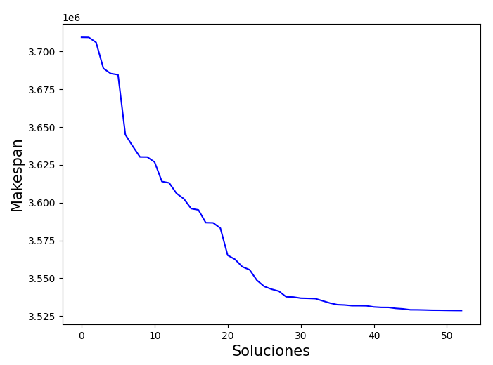
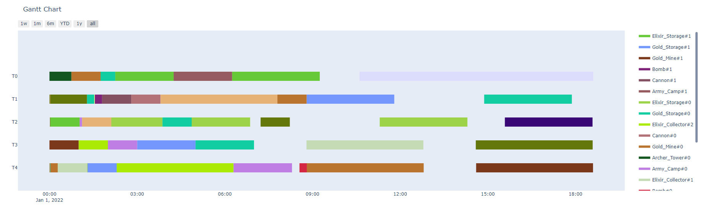

# Construcción óptima para Clash of Clans
Los siguientes gráficos muestran el resultado del algoritmo de Hill Climbing utilizado para encontrar una solución óptima para nuestro proyecto. La línea azul representa el makespan de la solución, que va mejorando a medida que el algoritmo realiza cambios en la solución inicial. La solución final es la mejor encontrada por el algoritmo y tiene un makespan mínimo.

## Mejor Mejora (Ayuntamiento 2 - 10)
### Ayuntamiento 2

### Ayuntamiento 3

### Ayuntamiento 4

### Ayuntamiento 5

### Ayuntamiento 6

### Ayuntamiento 7

### Ayuntamiento 8

### Ayuntamiento 9

### Ayuntamiento 10

A continuación se muestra la carta de Gantt correspondiente a la solución óptima encontrada por el algoritmo de Hill Climbing. La carta muestra cómo se distribuyen las tareas entre los 5 trabajadores disponibles, y también muestra la duración de cada tarea y cómo se relacionan entre sí.
 ### Ayuntamiento 2

### Ayuntamiento 3

### Ayuntamiento 4

### Ayuntamiento 5

### Ayuntamiento 6

### Ayuntamiento 7

### Ayuntamiento 8

### Ayuntamiento 9

### Ayuntamiento 10

Como se puede ver en la carta de Gantt, la solución óptima encontrada por el algoritmo de Hill Climbing permite subir al máximo la aldea en el menor tiempo encontrado.
